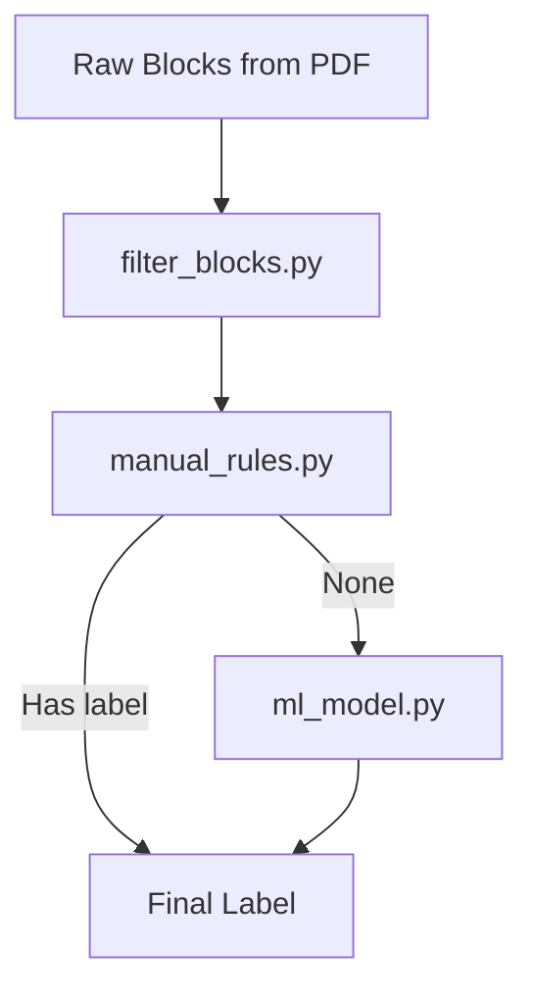

# Challenge 1A: Structured PDF Heading Extraction

## 🔍 Overview
This repository presents our submission for Challenge 1A of the Adobe India Hackathon 2025. The objective is to build a robust, intelligent, and containerized PDF processing pipeline that can extract a structured outline (Title, H1, H2, H3) from documents and export it in clean JSON format.

Our solution is:
- ⚙️ **Fully offline**
- 🧠 **A hybrid system (Machine Learning + Rule-based)**
- 🐳 **Dockerized for isolated, reproducible execution**
- ⚡ **Optimized for fast processing (under 10 seconds per 50-page PDF)**

## ✅ Official Challenge Requirements (Compliant)

| Requirement                          | Compliance                |
| ------------------------------------ | ------------------------- |
| ⏱️ Execution Time ≤ 10s (50-page PDF) | ✅ Achieved                |
| 🧠 Model Size ≤ 200MB                 | ✅ Compact model1.pkl      |
| 🌐 No Internet Access Required        | ✅ Fully Offline           |
| 👥 CPU-only (AMD64)                   | ✅ Docker uses linux/amd64 |
| 🔢 Output Format                      | ✅ JSON matches schema     |

## 🚀 Dockerized Execution

### Run the Image
```bash
docker run -p 8000:8000 imagename
```

### Build the Image
```bash
docker build -t your_image_name_here .
```

### Run the Container
```bash
docker run -p 8000:8000 image_name_here
```

- 📂 **Input Directory**: `/app/sample_dataset/pdfs`
- 📂 **Output Directory**: `/app/sample_dataset/outputs`
- 🔢 **Output Format**: `<filename>_output.json`

## 🧠 Pipeline Breakdown

### 1. OCR & Fallback Extraction (`ocr.py`)
This script ensures robust extraction of text from PDFs by converting each page into an image and applying Tesseract OCR.

- If the PDF does not contain extractable or well-structured text, `ocr.py` serves as the fallback mechanism.
- It guarantees accurate text extraction even from scanned documents or poorly formatted files.
- Uses parallel processing to speed up image rendering and OCR across pages.
- Each extracted block is enriched with positional metadata, layout context, and font attributes.
- This fallback design is critical in ensuring the model receives structured input regardless of the original PDF format.

### 2. Rule-Based Filtering (`filter_blocks.py`, `manual_rules.py`)
- Eliminates noisy or irrelevant blocks (e.g., footers, page numbers)
- Uses custom logic based on:
  - Font size, casing, alignment
  - Bullet points, numbering, special characters

### 3. ML-Based Classification (`ml_model.py`, `model1.pkl`)
- Trained XGBoost model predicts heading levels (`Title`, `H1`, `H2`, `H3`, `H4`)
- Uses features like font metrics, text density, punctuation, position, etc.
- Falls back to rule-based logic when prediction confidence is low

### 4. Final Structuring (`process_pdfs.py`)
- Extracts title from topmost block(s) on first page
- Orders headings by appearance and levels
- Outputs JSON file per document as per Adobe schema

## 📁 Project Structure

```
.
├── logic/                    # Core logic for filtering & classification
│   ├── filter_blocks.py
│   ├── hybrid_classifier.py
│   ├── manual_rules.py
│   └── ml_model.py
│
├── models/                   # ML model(s)
│   └── model1.pkl
│
├── sample_dataset/           # Input/output data
│   ├── pdfs/                # Input PDFs
│   ├── outputs/             # Output JSON files
│   └── schema/              # JSON schema (if applicable)
│
├── utils/                    # Explainability utilities
│   └── shap_explainer.py
│
├── ocr.py                   # OCR + rendering fallback module
├── process_pdfs.py          # 🔑 Docker entrypoint script
├── run_pipeline.py          # For local testing/debugging
├── model1.py                # ML training pipeline
├── model1.csv               # Training dataset
├── requirements.txt         # Dependency list
└── Dockerfile               # Container spec
```

## 📈 Sample Output Format

```json
{
  "title": "Understanding AI",
  "outline": [
    { "level": "H1", "text": "Introduction", "page": 1 },
    { "level": "H2", "text": "What is AI?", "page": 2 },
    { "level": "H3", "text": "History of AI", "page": 3 }
  ]
}
```

- **title**: Extracted from most prominent heading block
- **outline**: Sorted list of structured headings by page number

## 📊 Model Training (Optional)

To train or improve the model:
```bash
python model1.py
```

- Saves new model to `models/model1.pkl`
- **Outputs**:
  - Evaluation metrics
  - SHAP explanation plot

## 📃 Logging & Monitoring

All major stages of the pipeline are logged:
- PDF processing started
- OCR extraction count
- Filtered block count
- Predictions per block with source (ML or rule-based)
- Final output file saved

To capture logs to file:
```bash
docker run ... 2>&1 | tee logs/output.log
```
This logs output both to terminal and to a file.

---

# 📦 Dependencies & Technical Requirements

## Core Dependencies

### **pytesseract**
**Purpose**: Extract text from scanned pages (image-based PDFs) using OCR.

**Why pytesseract?**  
Because we needed something free, easy to plug in, and **supporting multiple languages**, pytesseract hit the sweet spot. We tuned it using `--psm 4`, which works well for paragraph-style OCR blocks. Alternatives like EasyOCR or Google Vision API were either too heavy (GPU/complex install) or not offline-friendly (API costs, latency).

### **Pillow**
**Purpose**: Image loading and manipulation (required for converting between OpenCV and pytesseract-compatible formats).

**Why Pillow?**  
It works hand-in-hand with Tesseract and plays nicely when converting between OpenCV's numpy arrays and Image.Image. It's lightweight and battle-tested.

### **opencv-python**
**Purpose**: Image pre-processing (grayscale conversion, thresholding) to boost OCR accuracy.

**Why OpenCV?**  
OCR isn't magic — raw images don't always yield clean results. So we apply OpenCV filters like binarization using Otsu's method. Alternatives like scikit-image exist but feel overkill here — OpenCV is faster, and we didn't need complex pipelines.

### **numpy**
**Purpose**: Used with OpenCV and also for numerical operations in image pre-processing and density calculations.

**Why numpy?**  
It's the glue between OpenCV, Pillow, and ML calculations. There's really no alternative when doing any array/image manipulations in Python.

### **xgboost>=1.7.0**
**Purpose**: Machine Learning model used for heading classification (Title, H1, H2, etc.).

**Why XGBoost?**  
We went with XGBoost for one main reason: **accuracy with tabular data**. Our model uses ~30 structured features per text block (like font size, margins, line counts). XGBoost is not only super fast but also handles imbalanced data and noisy features well. We tried RandomForest too, but XGBoost gave cleaner results with fewer false positives.

**Bonus**: we can inspect feature importance via SHAP or internal gain metrics.

---

# 🔧 Technical Implementation Details

## ocr.py — Hybrid OCR + Text Extraction Engine

This script handles text extraction from both text-based and scanned PDFs. It intelligently detects whether a page has extractable text or not, and falls back to OCR when needed. The goal is to extract clean, structured blocks from any kind of PDF input.

### 📦 Libraries Used

| **Library**          | **Why It's Used**                                                           |
| -------------------- | --------------------------------------------------------------------------- |
| `os`                 | To handle file paths and environment-independent file access                |
| `json`               | For saving and returning structured data (e.g., extracted blocks)           |
| `fitz (PyMuPDF)`     | To read PDF files and extract high-quality structured text, font info, etc. |
| `pytesseract`        | For OCR — used when the page is scanned or doesn't have a text layer        |
| `cv2 (OpenCV)`       | For preprocessing images (grayscale, thresholding) before running OCR       |
| `concurrent.futures` | For speeding up processing by running tasks in parallel                     |
| `numpy`              | For efficient image and array manipulation                                  |

### 🔧 Key Functions

#### `extract_features_from_block(block)`
- Extracts meaningful features from a block of text (like font size, word count, margins).
- These are useful later for identifying headings (Title, H1, Paragraph, etc.).

#### `_render_single_page(pdf_path, page_number)`
- Processes a single page from the PDF.
- If it has text, it extracts structured blocks using PyMuPDF.
- If it's scanned or empty, it adds it to a fallback list for OCR.

#### `render_pages_to_images_parallel(pdf_path)`
- Goes through all pages in parallel.
- Splits the output into two:
  - **structured_pages**: Pages with usable text extracted via PyMuPDF.
  - **fallback_pages**: Pages where OCR is required.

#### `_ocr_single_image(image_data)`
- Runs OCR on a single image (scanned PDF page).
- Uses OpenCV for image cleanup (grayscale, thresholding).
- Applies Tesseract OCR to get clean text output.

#### `apply_ocr_to_images_parallel(images)`
- Applies OCR on all fallback pages in parallel using the function above.
- Improves performance for large scanned PDFs.

#### `main(pdf_path, lang='eng')`
- This is the main function to call.
- It smartly applies both text extraction and OCR as needed.
- Returns structured JSON-like data with both:
  - **structured_blocks** (PyMuPDF extracted blocks)
  - **ocr_blocks** (OCR fallback pages)

---

# 📊 Dataset & Feature Engineering

## Dataset Feature Description (model.csv)

This project uses a structured dataset of PDF blocks (model.csv) for training a heading classification model. Each row represents a text block extracted from a PDF page, and the following features are used to classify it into categories like **Title**, **H1**, **H2**, or **Paragraph**.

### 🧠 Features and Their Purpose

| **Feature Name**                                             | **Description**                                     | **Purpose**                                                      |
| ------------------------------------------------------------ | --------------------------------------------------- | ---------------------------------------------------------------- |
| `text`                                                       | Raw text content of the block                       | Core input for all other textual/semantic features               |
| `text_len`                                                   | Number of characters in the block                   | Short blocks often indicate headings                             |
| `word_count`                                                 | Number of words                                     | Helps differentiate short headings from long paragraphs          |
| `line_count`                                                 | Number of lines in the block                        | Headings are usually within 1–2 lines                            |
| `avg_word_len`                                               | Average word length in the block                    | Longer average can indicate technical or formal text             |
| `font_size`                                                  | Font size used                                      | Headings usually have a larger font size                         |
| `font_name`                                                  | Font name used for the block                        | Different fonts may indicate different section types             |
| `is_bold`                                                    | 1 if bold, 0 otherwise                              | Headings are commonly bolded                                     |
| `is_italic`                                                  | 1 if italic, 0 otherwise                            | Can indicate emphasis or stylized headings                       |
| `is_centered`                                                | 1 if block is center-aligned                        | Titles and main headings are often centered                      |
| `is_uppercase`                                               | 1 if all characters are uppercase                   | Uppercase often used in headings or titles                       |
| `starts_with_number`                                         | 1 if block starts with a digit                      | Helps detect numbered lists or sections                          |
| `top_margin`, `bottom_margin`, `left_margin`, `right_margin` | Margins from the page edges                         | Positional clues for block placement                             |
| `contains_colon`                                             | 1 if block contains a :                             | Colons are common in headings and section labels                 |
| `contains_bullet`                                            | 1 if block contains bullet characters               | Indicates list items, not headings                               |
| `special_char_count`                                         | Count of non-alphanumeric characters                | Useful to detect non-headings or noise                           |
| `density_score`                                              | Density of text (characters per area)               | Helps differentiate between dense paragraphs and sparse headings |
| `font_size_rank`                                             | Font size rank in the document                      | Headings usually have top-ranked font sizes                      |
| `text_length_bucket`                                         | Bucketed version of text_len                        | Used for categorical modeling of text size                       |
| `ends_with_colon`                                            | 1 if text ends with a colon                         | Often indicates a header or list starter                         |
| `line_count_gt_3`                                            | 1 if more than 3 lines                              | Likely a paragraph                                               |
| `has_numbers_only`                                           | 1 if text contains only digits                      | Often figure/table numbers                                       |
| `has_mixed_case`                                             | 1 if block has both upper and lowercase             | Indicates normal sentence case (likely paragraph)                |
| `has_dash_or_underscore`                                     | 1 if contains - or _                                | Could indicate metadata or structured points                     |
| `is_all_punctuation`                                         | 1 if text is only punctuation                       | Likely non-meaningful block (noise)                              |
| `word_density`                                               | Words per unit area or line                         | Higher values likely indicate paragraph text                     |
| `page_num`                                                   | Page number of the block                            | Helps contextualize block (e.g. title on first page)             |
| `is_first_page`                                              | 1 if block is from first page                       | First page often contains title/TOC                              |
| `label`                                                      | Ground truth label (Title, H1, H2, Paragraph, etc.) | Target for training supervised models                            |

---

# 🧩 Core Intelligence Engine (`logic/` Folder)

The `logic/` folder contains the **heart of the heading classification system**, consisting of rule-based filtering, ML-based classification, hybrid fallback logic, and custom heuristics. Here's a detailed breakdown of how these modules work together:

## 🔹 filter_blocks.py — Text Block Cleaner & Heading Scorer

This file applies a series of intelligent **preprocessing and filtering techniques** to clean raw text blocks from documents. It ensures only **high-quality, heading-like blocks** proceed to the classification stage.

**Key Features:**
- **Boilerplate Removal:** Ignores common footer/header terms like "confidential", "page", "figure", etc.
- **Heading Scoring:** Assigns a score (0 to 1) to estimate if a block is a heading based on:
  - Font rank
  - Bold/centered
  - Word/line count
  - Text format (uppercase/title case)
- **Noise Removal:** Removes blocks that are:
  - All punctuation
  - Sentences (not headings)
  - Very short common words ("the", "and", etc.)
  - Repetitive blocks like footers on every page

📌 **Why It Matters:** This step reduces noise dramatically and ensures cleaner input for both manual and ML classification stages.

## 🔹 manual_rules.py — Rule-Based Classifier

This module uses **hard-coded heuristics** to label headings based on **visual and positional cues**, like:

**Key Conditions Handled:**
- Font size rank
- Bold/italic/uppercase
- Word/line count
- Text alignment (centered)
- Text format like 1., 1.1, 1.1.1 → mapped to H1/H2/H3

**Returns:** "Title", "H1" to "H4" or None

📌 **Why It Matters:** Manual rules can **instantly catch the obvious headings** without needing the ML model, improving speed and accuracy.

## 🔹 ml_model.py — ML-Based Heading Classifier

This script loads a pre-trained ML model (via joblib) and uses it to classify text blocks.

**Key Responsibilities:**
- Loads model and feature names
- Accepts a block dictionary, converts it into a feature vector
- Predicts heading label probabilities
- Returns top candidates with confidence scores

**Output Example:**
```json
[
  {"label": "H2", "confidence": 0.78},
  {"label": "H3", "confidence": 0.12}
]
```

📌 **Why It Matters:** When manual rules fail, the ML model provides **robust, generalizable classification** across diverse layouts.

## 🔹 hybrid_classifier.py — Smart Hybrid Engine

This module orchestrates the **two-stage classification process**:

1. Tries `manual_rules` first (fast, rule-based)
2. If no result, falls back to `ml_model` for prediction
3. Filters out weak headers like "H5"

**Output Fields:**
- `final_label`: Assigned label
- `source`: "manual" or "ml"
- `candidates`: All ML prediction options

📌 **Why It Matters:** Provides the best of both worlds — **fast precision from rules + deep coverage from ML.**

## 🧩 How These Files Work Together



- `filter_blocks.py` → Cleans and scores heading candidates
- `manual_rules.py` → Tries fast, interpretable classification
- `ml_model.py` → Predicts fallback heading label (if rules fail)
- `hybrid_classifier.py` → Manages all logic in one place for external modules to use

---

# 📄 Final Notes

- **Entry point**: `process_pdfs.py`
- **No hardcoded filenames or assumptions**
- **Modular, scalable design** ready for future extension (e.g., semantic search, Round 1B, etc.)

**Let's connect the dots. One heading at a time.** 🧠📄
